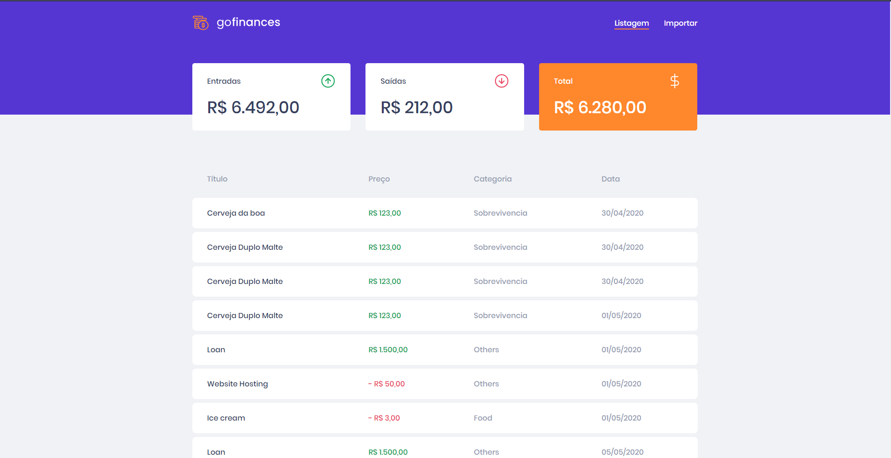
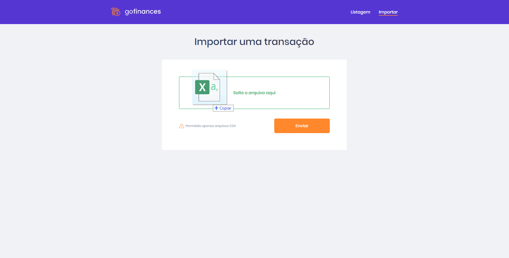
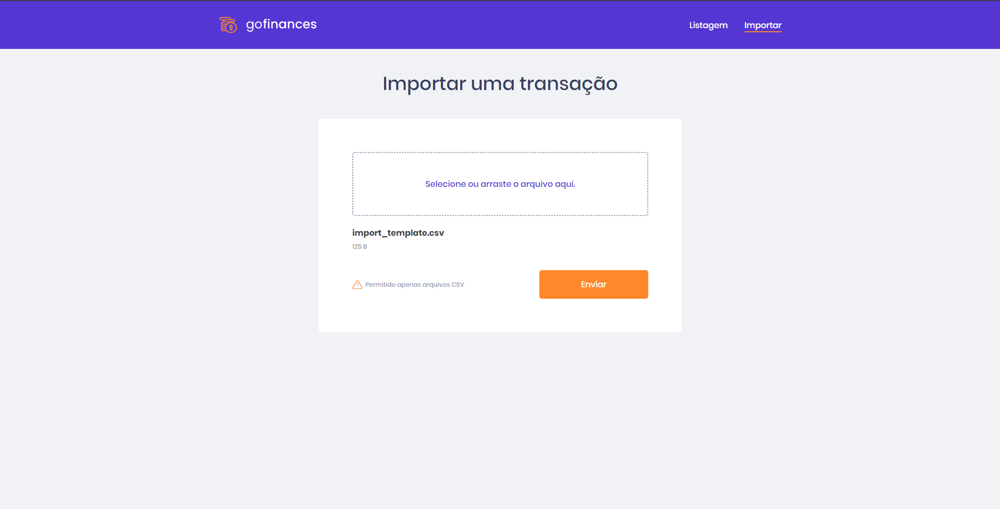
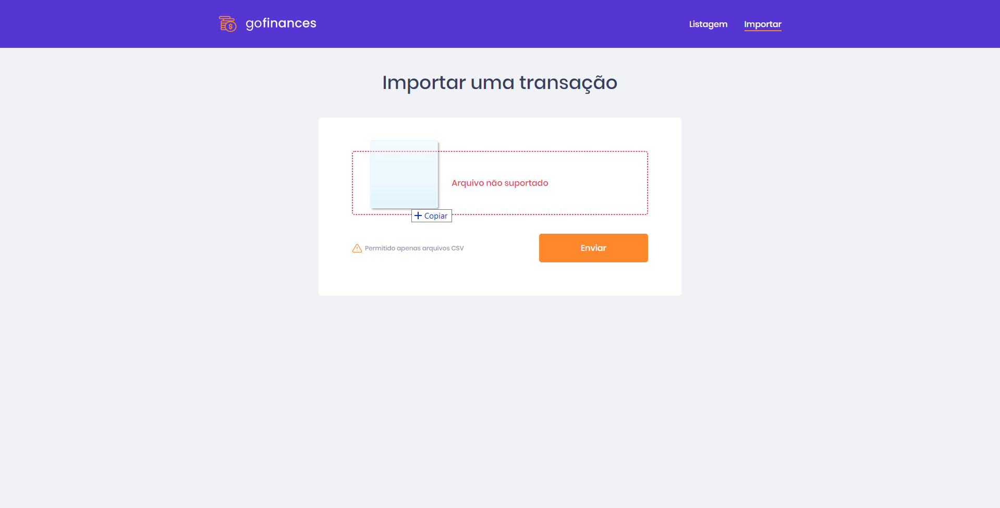

<h1 align="center">
    
</h1>

# Finance App

  <a href="#rocket-sobre-o-desafio">Sobre</a>&nbsp;&nbsp;&nbsp;|&nbsp;&nbsp;&nbsp;
  <a href='#gear-oque-foi-utilizado'>Oque foi utilizado</a>&nbsp;&nbsp;&nbsp;|&nbsp;&nbsp;&nbsp;
  <a href="#camera-imagens">Imagens</a>&nbsp;&nbsp;&nbsp;|&nbsp;&nbsp;&nbsp;
  <a href="#Instalar e usar">Instalar e usar</a>

## 🔎 Sobre

Desenvolvimento do Front End da aplicação de finanças do desafio 6.

<a href='https://github.com/nelsonplinio/finance-app-typeorm'>Repositório Back-end</a>

## ⚙️ Oque foi utilizado

  - React
  - React hooks
  - Axios
  - Typescript
  - prettier
  - styled-components
  - react-router-dom

## 📷 Imagens

<strong></strong>

 

 

 

 

 

## 🚀 Instalar e usar

###### Clone o respostiorio.
``git clone git@github.com:nelsonplinio/finance-app-front-end.git`

###### Instalar as dependencias.
``cd finance-app-front-end ``
`` yarn ou npm install``

###### Instalar as dependencias.
``yarn start ou npm run start ``
